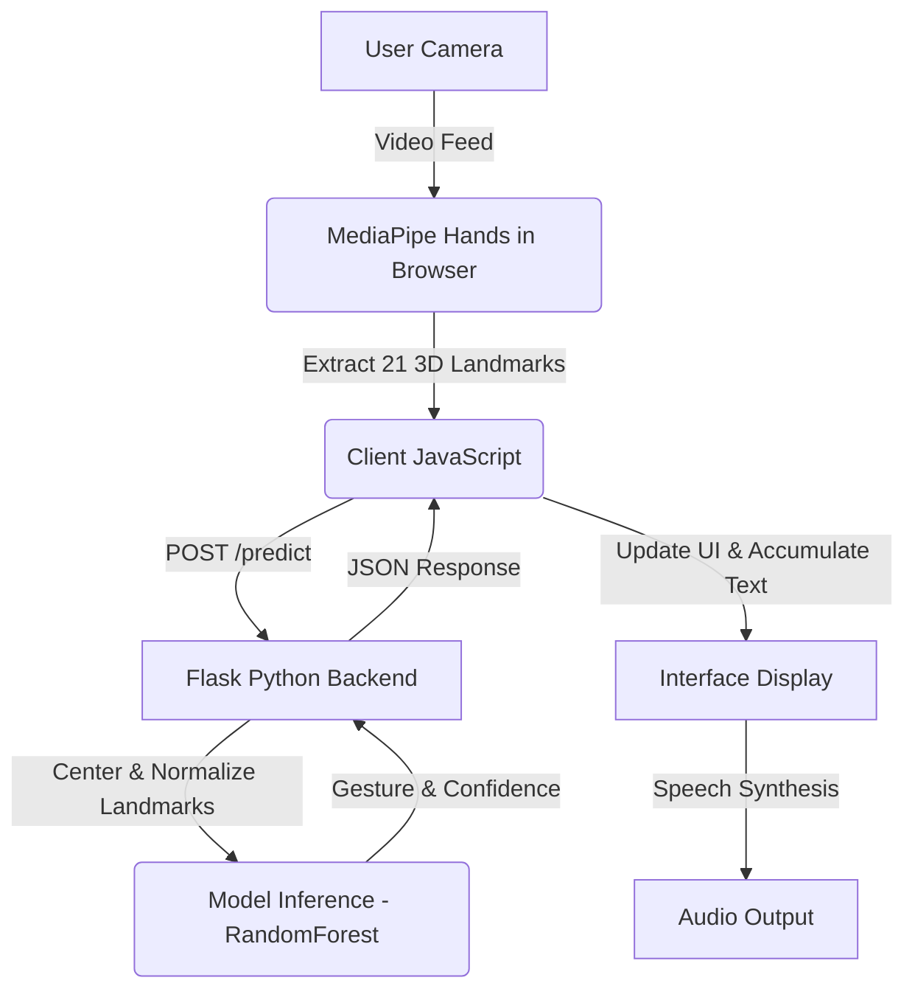

# 🤟 VisionSign Pro: Real-time ISL Translator

[](https://converting-sign-to-text.onrender.com/)
[](https://www.python.org/)
[](https://flask.palletsprojects.com/)
[](https://google.github.io/mediapipe/)
[](https://render.com/)

VisionSign Pro is a state-of-the-art Indian Sign Language (ISL) recognition and translation system. By combining high-fidelity browser-side hand landmark tracking via **Google MediaPipe** and a robust machine learning backend (Scikit-Learn Random Forest) trained with **30x synthetic data augmentation**, it translates hand gestures into text and spoken voice in real time.

🔗 **Try the live site:** [VisionSign Pro on Render](https://converting-sign-to-text.onrender.com/)
> ⚠️ **Note:** Since the web application is hosted on Render's free tier, the server spins down after periods of inactivity. Please allow up to **50 seconds** for the initial load if the server is asleep.

---

## ✨ Key Features

- 🧠 **Robust AI Inference**: Uses a Random Forest classifier trained with heavy data augmentation (3D rotations, perspective distortion, scaling, finger morphing, and Gaussian noise) to achieve high robustness against varying hand angles and positions.
- 🎨 **Premium Glassmorphic UI**: A stunning, modern dark-mode user interface designed with a clean, responsive layout, real-time confidence bars, and micro-animations.
- ⚡ **Hybrid Architecture**: Low-latency, client-side landmark extraction using MediaPipe Hands reduces payload size. Only 21 3D coordinates (flat list of 63 values) are sent to the Python Flask backend for prediction, ensuring lightning-fast inference.
- 🗣️ **Text-to-Speech (TTS)**: Synthesizes translations into spoken audio instantly with the click of a button.
- 🎤 **Voice-to-Sign Translation**: Speak a word via your microphone and see it translated back into the corresponding ISL hand gestures instantly.
- 📖 **Interactive Gesture Chart**: A built-in modal chart mapping letters to their respective ISL hand signs.

---

## 🛠️ System Architecture



---

## 🚀 Quick Start (Local Setup)

### 1. Clone & Install Dependencies
First, install the required packages on your system:
```bash
pip install -r requirements.txt
```
*(If you plan to run data collection or local training, you may also need `pandas` and `scikit-learn`)*

### 2. Run the Application
Start the Flask backend (it serves both the API and the static frontend):
```bash
python app.py
```
Open your browser and navigate to `http://localhost:5000` (or the port specified in your console).

---

## 📂 Project Structure

- `index.html` - The frontend application (MediaPipe configuration, CSS layouts, and UI logic).
- `app.py` - Flask web server and prediction API route.
- `model.joblib` - The trained Random Forest classifier.
- `labels.json` - Maps index predictions back to alphabetical characters (A-Z).
- `train_tf_model.py` - Advanced training pipeline utilizing 30x data augmentation.
- `data_collection.py` - CLI utility to collect customized datasets for new gestures.
- `landmarks.csv` - The raw training coordinates database.
- `assets/` - Image directories containing gesture diagrams (A-Z) and the ISL reference chart.

---

## 💡 Training & Customization Tips

If you want to train the model with your own custom signs:
1. **Collect Data**: Run `python data_collection.py` and follow instructions to register coordinates for specific gestures. Move your hand slightly during recording to capture minor angle and distance differences.
2. **Train Model**: Run `python train_tf_model.py`. The script will apply **3D rotation, scaling, and finger morphing** to augment your base dataset by 30x, generating a highly resilient classifier before saving it as `model.joblib`.
